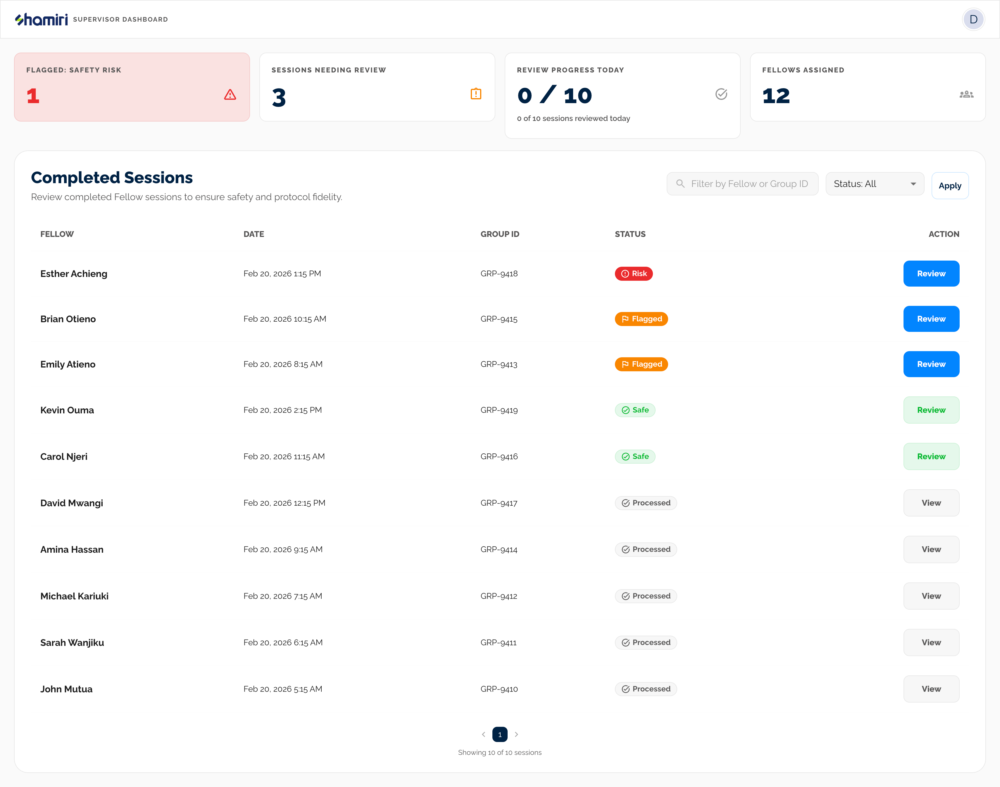
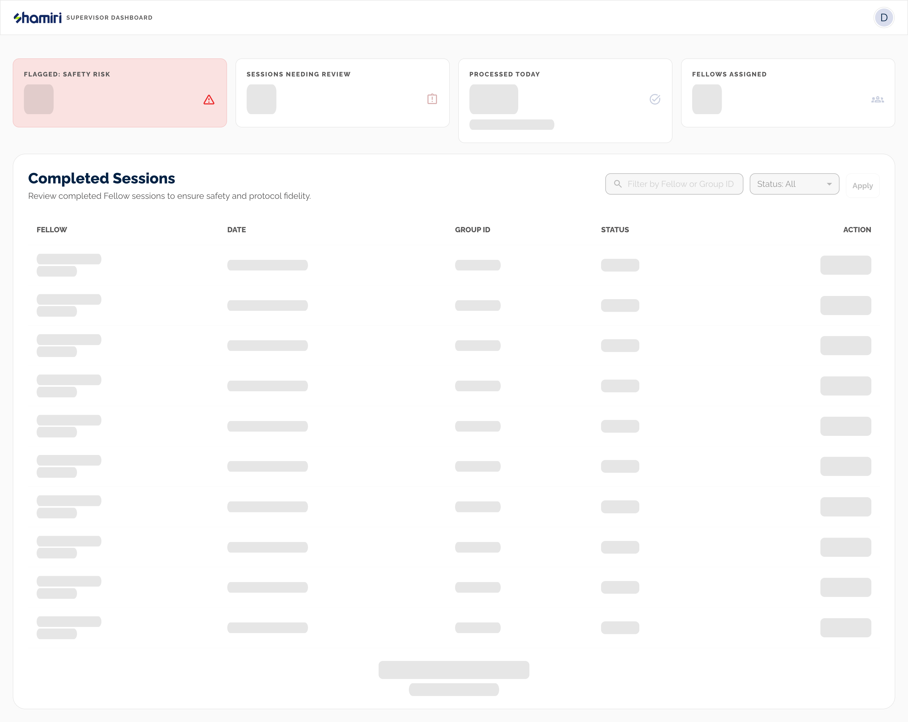
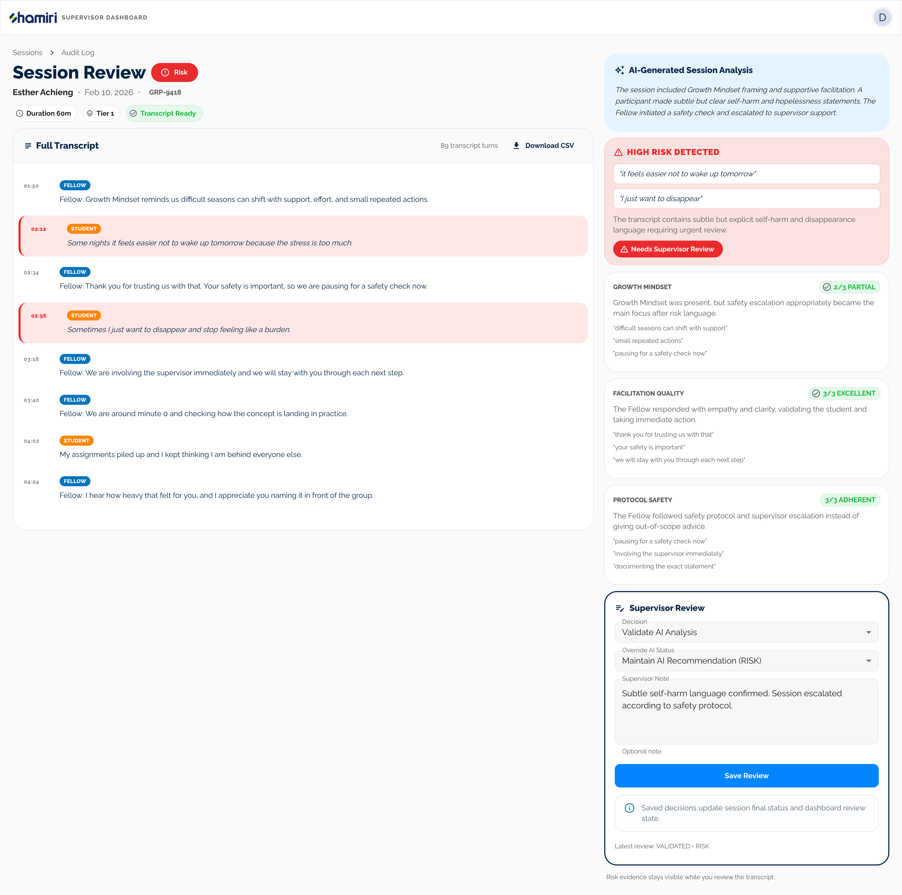
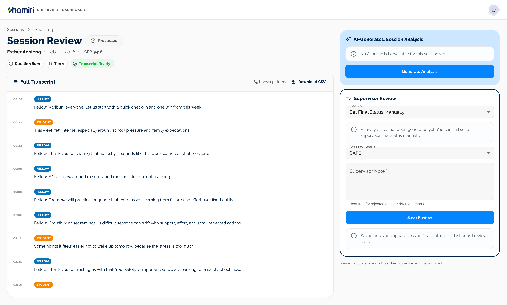
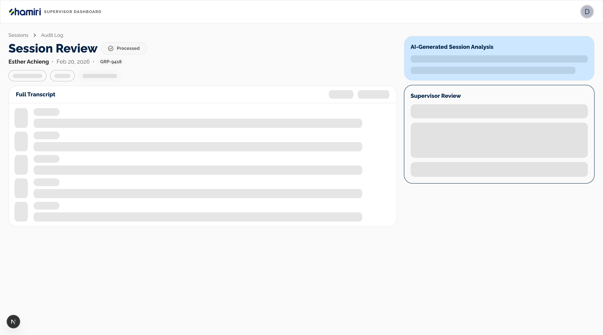
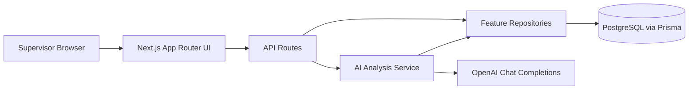

# Shamiri Supervisor Copilot

A web-based, AI-powered dashboard that helps Shamiri supervisors review Fellow-led therapy sessions for quality and safety.

## Context

Shamiri uses a Tiered Care Model where young Fellows deliver structured mental health sessions and supervisors ensure quality and safety. The core bottleneck is review capacity: supervisors cannot manually audit every 40-60 minute transcript as volume grows.

## Problem Statement and Solution

### Problem

- Supervisors need fast visibility into session quality and safety risk.
- Manual review of every transcript is not feasible at scale.
- AI output alone is not enough because decisions must remain clinician-supervised.

### Solution

This project implements a "Supervisor Copilot" that:

- Authenticates supervisors.
- Lists completed sessions with derived status.
- Generates structured AI analysis on demand.
- Supports supervisor validate/reject/override with notes.
- Persists final human-reviewed status as system of record.

## Demo

- Live app: [https://shamiri-take-home-assignment.vercel.app](https://shamiri-take-home-assignment.vercel.app)
- Core flows:

1. Login as supervisor.
2. Open dashboard and inspect status-prioritized session list.
3. Open session detail, generate analysis, inspect risk banner/rubric cards.
4. Submit supervisor review decision and note.

### Demo Credentials

- Email: `supervisor@shamiri.demo`
- Password: `Password123!`

### Screenshots / GIF

#### Dashboard (Loaded)



#### Dashboard (Route-Level Loading Skeletons)



#### Session Detail (Loaded)



#### Session Detail (Before Analysis / Unprocessed)



#### Session Detail (Route-Level Loading Skeletons)



#### Session Detail (Generate Analysis In Progress)


#### End-to-End Analyze + Review Flow (GIF)


## Product Overview

### Core user journeys

1. Supervisor logs in with credentials.
2. Dashboard shows completed sessions and key workload/safety metrics.
3. Supervisor opens a session detail view with transcript + AI panel.
4. If needed, supervisor triggers analysis (`POST /api/sessions/:id/analyze`).
5. Supervisor validates/rejects/overrides AI output and stores note (`POST /api/sessions/:id/review`).

### Key Features

- Status-aware dashboard with filters/search/pagination.
- Status chips with icon + label and risk-first ordering.
- Session detail optimized for transcript review + safety triage.
- Structured AI output enforcement with Zod-derived JSON Schema.
- Human-in-the-loop review workflow with audit notes.
- Seed data with realistic 40-60 minute transcript scenarios.

## Tech Stack

- Framework: Next.js 16 App Router (React 19)
- Language: TypeScript
- UI: MUI 7
- Auth: NextAuth (credentials)
- DB: PostgreSQL + Prisma
- AI: OpenAI (`gpt-4o-mini`) with structured JSON schema output
- Validation: Zod
- Testing: Vitest + Playwright
- Tooling: ESLint, Prettier, Husky, lint-staged

## Architecture Overview



### Architectural boundaries

- `src/app/*`: routing + page composition.
- `src/features/*`: feature UI + feature server repository logic.
- `src/server/services/ai/*`: prompting, schema enforcement, model orchestration.
- `src/server/db/*`: connection policy and Prisma client setup.

## Project Structure

```txt
src/
  app/
    (auth)/login
    (supervisor)/dashboard
    (supervisor)/sessions/[sessionId]
    api/auth/[...nextauth]
    api/sessions
    api/sessions/[sessionId]
    api/sessions/[sessionId]/analyze
    api/sessions/[sessionId]/review
  features/
    dashboard/components
    sessions/components
    sessions/server
    sessions/utils
  server/
    auth
    db
    services/ai
    repositories
  components/
    auth
    layout
    ui
prisma/
  schema.prisma
  seed.ts
tests/
  unit
  e2e
```

## Data Model

### Core entities

- `Supervisor`: account + ownership boundary.
- `Fellow`: belongs to one supervisor.
- `Session`: transcript + optional `finalStatus`.
- `AIAnalysis`: idempotent analysis snapshot (`resultJson`, `safetyFlag`, `promptVersion`, latency/size metadata).
- `SupervisorReview`: human decision + `finalStatus` + note.

### Canonical status model

`finalStatus` is the source of truth after human review and remains `null` until a supervisor submits a decision.

Display fallback when `finalStatus` is null:

1. `analysis.safetyFlag === RISK` -> `RISK`
2. `analysis.requiresSupervisorReview === true` -> `FLAGGED_FOR_REVIEW`
3. `analysis.safetyFlag === SAFE` -> `SAFE`
4. Otherwise -> `PROCESSED`

This ensures AI assists triage while preserving supervisor authority.

## AI Analysis Engine

### Schema contract

- Canonical schema source: Zod (`SessionAnalysisLLMOutputSchema`).
- JSON Schema is derived from Zod (`z.toJSONSchema`) and passed to OpenAI with strict mode.
- Final persisted DTO adds metadata (`model`, `promptVersion`, latency, transcript window stats).

Key file:

- `src/server/services/ai/schemas.ts`

### Prompt engineering and versioning

- Prompt version is explicit (`PROMPT_VERSION = session-analysis-v5`).
- Prompt encodes rubric dimensions + risk policy.
- Transcript content is treated as untrusted input; model is instructed to ignore in-transcript instructions.

Key file:

- `src/server/services/ai/prompts.ts`

### Retries and fallback behavior

- Analysis attempts: up to 2 parses.
- Attempt 2 appends strict reminder for valid JSON if attempt 1 fails validation.
- If still invalid -> `422` (`AIOutputValidationError`) from analyze endpoint.

Key file:

- `src/server/services/ai/analyzeSession.ts`

### Safety bias

- `RISK` is reserved for explicit, current, first-person high-concern safety language.
- Ambiguous or borderline concerns remain `SAFE` but are triaged with `requiresSupervisorReview = true`.
- Server-side safety backstops prevent silent misses:
  - explicit high-concern phrases can be force-escalated from `SAFE` to `RISK`
  - weak rubric outcomes can force `requiresSupervisorReview = true`
- `requiresSupervisorReview` is a secondary operational flag for workflow triage, while `SAFE/RISK` remains the official risk classification contract.

## Human-in-the-Loop Workflow

1. Supervisor opens session detail.
2. If analysis exists, render insight/risk/rubric cards.
3. If analysis missing, supervisor triggers generate analysis.
4. Supervisor submits decision:
   - `VALIDATED`
   - `REJECTED`
   - `OVERRIDDEN`
5. API persists review and updates session `finalStatus`.
6. Dashboard and detail routes are revalidated.

## API Contracts

- `GET /api/sessions`
  - Returns paginated `SessionListResult` for authenticated supervisor.
- `GET /api/sessions/:sessionId`
  - Returns `SessionDetailDTO` with transcript + optional analysis + latest review.
- `POST /api/sessions/:sessionId/analyze`
  - Idempotent; returns existing analysis or generates/persists new analysis.
- `POST /api/sessions/:sessionId/review`
  - Validates payload, enforces auth/ownership, persists review + final status.

## Error Handling

- Auth/ownership checks on all protected routes (`401/403/404`).
- Validation errors (`422`) for malformed review payload and invalid AI output after retries.
- Server-side logging avoids transcript leakage; logs identifiers + error name/message.
- Loading/error boundary files exist for dashboard and session detail routes.

## Example Scenarios (Seeded)

`prisma/seed.ts` includes 10 sessions covering rubric/safety variation:

- 3 strong Growth Mindset coverage (`COMPLETE`).
- 2 partial coverage.
- 1 missed content.
- 2 protocol drift.
- 1 subtle self-harm signal.
- 1 control/baseline session.

Durations are set between 41-60 minutes with long synthetic transcripts to simulate realistic review workload.

## Tradeoffs and Decisions

### Why on-demand analysis (vs batch)

- Pros:
  - Lower token spend during development.
  - Analysis generation tied to explicit supervisor intent.
  - Easier to debug and evaluate prompt iterations.
- Cons:
  - First-open latency for unanalyzed sessions.
  - Requires manual trigger for full coverage.

### Why strict JSON schema enforcement

- Pros:
  - Predictable contract for UI rendering.
  - Strong guardrails against malformed model output.
  - Easier observability and versioned comparisons.
- Cons:
  - Slightly higher prompt/response brittleness across model changes.
  - Retry logic needed when model fails strict schema.

## Verification Process

### Automated checks

- `pnpm typecheck`
- `pnpm lint:ci`
- `pnpm test:unit`
- `pnpm test:e2e`

### Test suites

- Unit tests: search param parsing, status derivation, AI schema constraints.
- E2E tests: login page render, unauthenticated redirect, credential auth flow.

## Setup & Installation

### Prerequisites

- Node 20+
- pnpm 10+
- PostgreSQL

### Environment variables

Create `.env` from template and fill values:

```bash
cp .env.example .env
```

Required:

- `DATABASE_URL`
- `OPENAI_API_KEY`
- `NEXTAUTH_SECRET`

Recommended for local auth callback consistency:

- `NEXTAUTH_URL=http://localhost:3000`

### Install

```bash
pnpm install
```

### Database

```bash
pnpm prisma migrate dev
pnpm prisma db seed
```

Default seed behavior is reviewer-friendly:

- sessions + transcripts are created
- no pre-generated AI analyses
- no pre-created supervisor reviews/final statuses

Optional toggles:

- `SEED_REFERENCE_ANALYSIS=true`
- `SEED_SUPERVISOR_REVIEWS=true`

### Run locally

```bash
pnpm dev
```

Open [http://localhost:3000](http://localhost:3000).

## Scaling Strategy

Short-term path:

- Keep synchronous on-demand analysis for deterministic UX.
- Add caching and idempotency (already present at session level).

Medium-term path:

- Move analysis to queue-backed async workers.
- Persist run state (`PENDING`, `RUNNING`, `FAILED`, `COMPLETE`) per analysis job.
- Add retry backoff + dead letter queue for model/API failures.

Long-term path:

- Multi-model routing and rubric calibration.
- Supervisor workload prioritization based on risk confidence and SLA windows.

See:

- `docs/architecture/FUTURE_ARCHITECTURE.md`

## Cost Projection at Scale

A rough cost model and assumptions are documented here:

- `docs/scaling/COST_PROJECTION.md`

## African Context Considerations

- Low bandwidth:
  - Server-rendered pages and minimal client JS for critical workflows.
  - Status-first dashboard prioritization to reduce navigation burden.
- Language/code-switching (English + Swahili):
  - Prompt layer is structured to allow future bilingual rubric adaptation.
  - Future roadmap includes bilingual evaluation datasets and language-aware quoting.
- Power/network reliability:
  - Idempotent analyze endpoint reduces duplicate writes on retries.
  - Review submission persists source-of-truth final status once connectivity returns.

## AI Tooling Disclosure

A detailed collaboration note is provided in:

- `docs/ai/AI_COLLABORATION_REPORT.md`

Summary:

- AI-assisted:
  - Prompt and schema iteration.
  - UI layout polish and accessibility refinements.
  - Test scaffolding and edge-case debugging.
- Human-owned decisions:
  - Data model boundaries and status semantics.
  - Safety policy and escalation behavior.
  - Final code review, acceptance criteria, and tradeoff decisions.

## Key Learning

The highest leverage pattern was treating AI as a typed subsystem, not an untyped string generator. Strong schema contracts + explicit human override semantics significantly reduced ambiguity in both UX and backend behavior.
